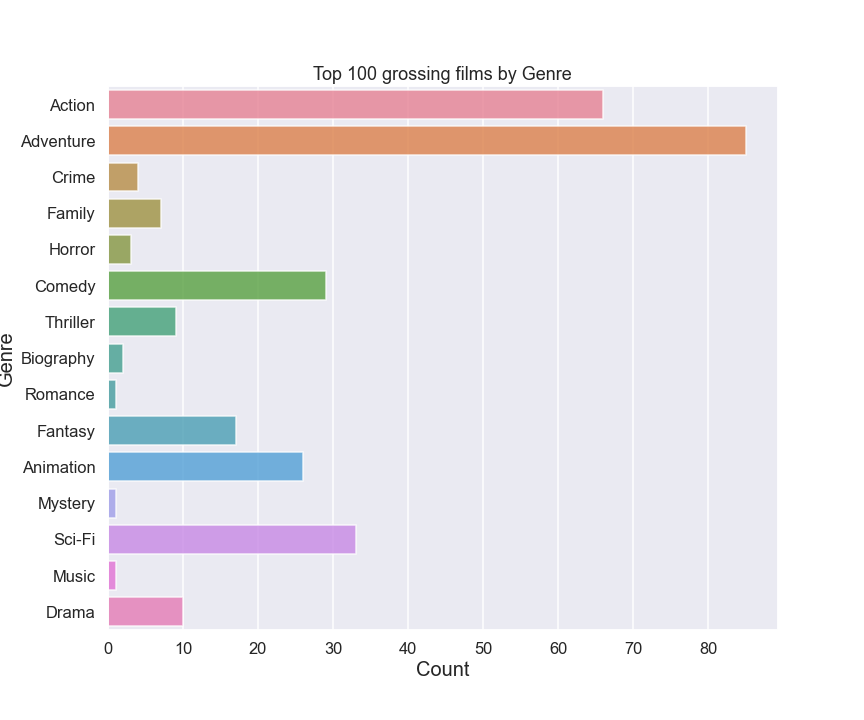

# First Project: Microsoft New Movie Studio

**Authors**: Ivan Torres

## Overview

The following project is intended to suggest recommendations in the new Microsoft movie studio. More than 15k movies were analyzed in this project

## Business Problem

The new movie studio could reduce its costs and use its resources more effectively. This could help the study to obtain profit in its beginnings

The important points that we will analyze now are the following:
* Which genre is the most profitable?
* How much the new studio should invest in the production of the movie?
* What would be a good runtime for the movie?
***

## Data

The Data used in this project are Datasets from [The Numbers](https://www.the-numbers.com) and [IMDB](https://www.imdb.com). 
The TN Dataset provide us with cost of productions and grossing and the IMDB Dataset have the genres, runtime and other basic information

## Methods

This project uses descriptive analysis, helping us to describe the trends in the Genres, Runtime and Production budget.

## Results

In our top 100 grossing movies they used the following amount of money to cover the productions cost


### Graphs


The top 3 grossing genres in our Top 100 Grossing movies



The grossing movies by runtime


## Conclusions
This analysis leads to three recomendations to help save money and obtain profits

***

* The 3 top genres are the followings : 1st place is Adventure, 2nd Action and 3rd Sci-Fi
* The production budget should be around the 150 - 220 millions dollars.
* the runtime of the movie should be around 1:40 hours to 2:20 hours long movie

The 3 recommendations stated before could lead to a profit of 500 - 1000 million dollars
***

## Next Steps

***
* This model could use aditional infomartion such as Studios, Actors/Actress, Directors. To see if factors have an impact on the prdocution budget or in the monetary succes of a film.

Please review our full analysis in [our Jupyter Notebook](./dsc-phase1-project-template.ipynb) or our [presentation](./DS_Project_Presentation.pdf).

For any additional questions, please contact **name & email, name & email**

## Repository Structure

```
├── README.md                         
├── phase1-project.ipynb  
├── Presentation.pdf        
├── data                                
└── images                             
```
